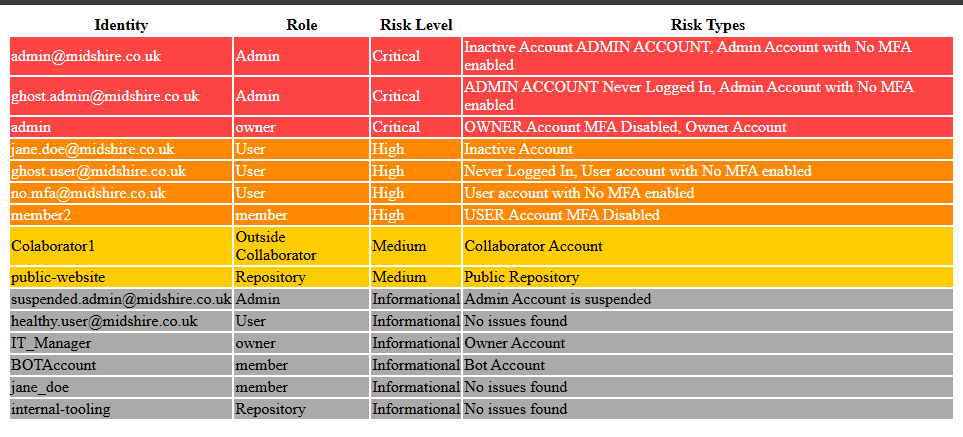
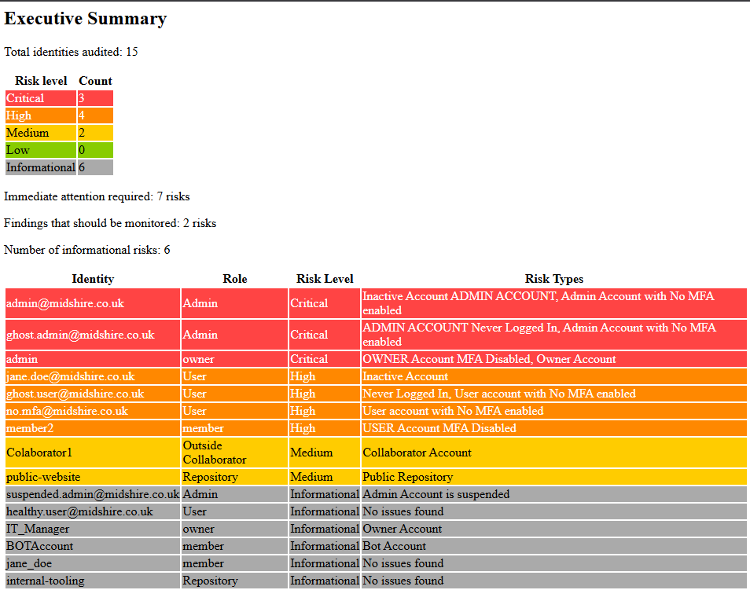
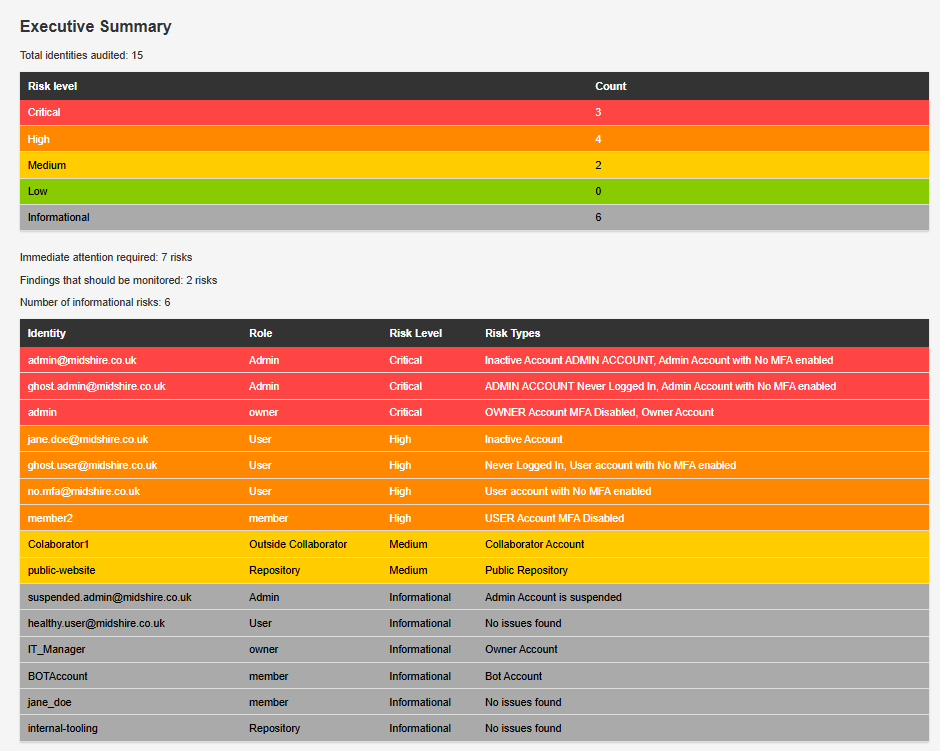
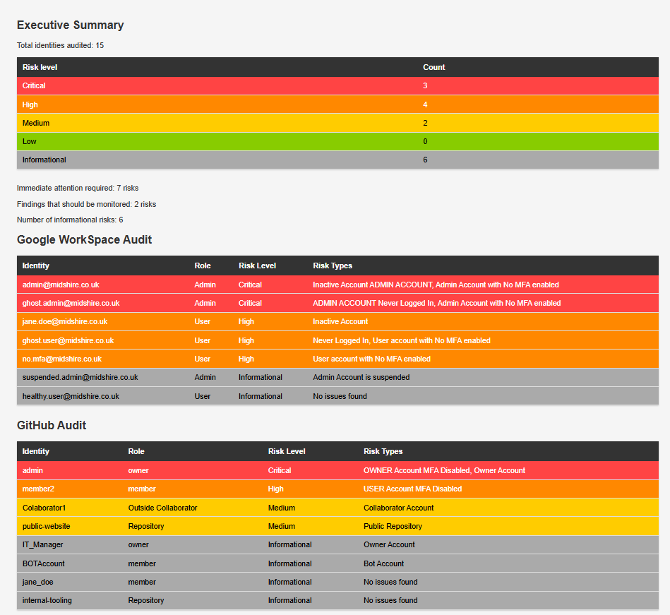

# Google Workspace & GitHub IAM Audit Tool

## Overview
After researching tools like Vanta and Drata, I wanted to build my own version 
using OAuth 2.0 and REST APIs. This tool audits user access across Google 
Workspace and GitHub, identifying security risks and generating a colour-coded 
HTML compliance report sorted by risk level.

The tool checks Google Workspace accounts for MFA status, inactive accounts, 
admin privileges, and suspended accounts. It checks GitHub organisations for 
member MFA status, outside collaborators, repository visibility, and bot accounts.

This tool uses mock data for Google Workspace as a live Workspace admin account 
was not available for testing. The OAuth 2.0 flow and GitHub API connection both 
work against live endpoints.

## Report Iterations

### V1 — Basic Report

Basic colour-coded table with no styling or summary.

### V2 — Executive Summary Added

Added executive summary with risk counts and action guidance.

### V3 — Styling Improved

Improved CSS styling, better readability.

### V4 — Platform Separation (Current)

Split into separate Google Workspace and GitHub tables for clarity.

## Skills Demonstrated
- OAuth 2.0 implementation with token caching and silent refresh
- REST API integration across Google Workspace Admin SDK and GitHub API
- Identity and Access Management auditing across multiple platforms
- Risk analysis and escalation logic aligned to NCSC CAF Principle B2
- Security applied to own tooling including fine-grained PATs, .env secrets management, token expiry and filesystem permissions
- Separate files for auth, data collection, risk analysis and reporting making the codebase easier to maintain and audit
- HTML report generation with executive summary for non-technical stakeholders

## Security Considerations
- All sensitive credentials stored in `.env` and excluded from Git via `.gitignore`
- GitHub PAT uses fine-grained permissions with only the minimum scopes required
- PAT configured with 90 day expiry to limit the exposure window
- `token.json` restricted to owner read/write only via `os.chmod(token, 0o600)`
- Virtual environment used to isolate dependencies
- Dependencies pinned in `requirements.txt` to mitigate supply chain risk

## Setup Instructions
1. Clone the repository
2. Create and activate a virtual environment:
```bash
python -m venv venv
venv\Scripts\activate  # Windows
source venv/bin/activate  # Mac/Linux
```

3. Install dependencies:
```bash
pip install -r requirements.txt
```

4. Set up Google Cloud project. Enable the Admin SDK API, create OAuth 2.0 
   Desktop credentials and download `credentials.json` to the project root.

5. Create a GitHub organisation and generate a fine-grained PAT with 
   Contents, Metadata and Members set to Read only.

6. Create `.env` file in project root:
```
GITHUB_TOKEN=your_pat_here
GITHUB_ORG=your_org_name_here
```

## Usage
```bash
python audit.py
```

Set `USE_MOCK_DATA = True` in `config.py` to run against mock data.
Set `USE_MOCK_DATA = False` to run against live APIs.

The report is generated as `report.html` in the project root.

## Risk Matrix

### Google Workspace
| Risk | Level |
|------|-------|
| Admin account with no MFA | Critical |
| Admin inactive 90+ days | Critical |
| Admin never logged in | Critical |
| User with no MFA | High |
| User inactive 90+ days | High |
| User never logged in | High |
| Suspended account | Informational |

### GitHub
| Risk | Level |
|------|-------|
| Owner with MFA disabled | Critical |
| Member with MFA disabled | High |
| Outside collaborator | Medium |
| Public repository | Medium |
| Owner account | Informational |
| Bot account | Informational |

## Limitations
- Google Workspace integration tested against mock data only as a live Workspace admin account is required for production use
- Outside collaborator repository permissions not checked as this would require additional API calls per collaborator per repository
- No historical trend data as each run is a point-in-time snapshot

## Next Steps
- Per-repository collaborator permission checks
- GitHub Actions workflow audit
- Trend tracking across multiple report runs
- Email alerting for Critical findings
- Testing against a live Google Workspace environment

## NCSC CAF Principle B2 Alignment
This tool directly addresses CAF Principle B2 — Identity and Access Control.

- **B2.a** Account management: identifies inactive, unused and suspended accounts
- **B2.b** Authentication: flags accounts without MFA enforced
- **B2.c** Privileged access: identifies admin and owner accounts for review
- **B2.d** Access control: audits external collaborator and repository access

